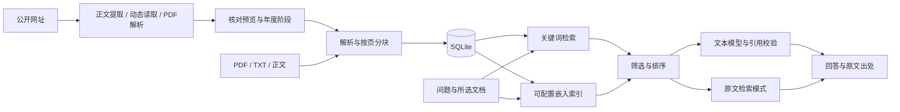

# 申报通 · RAG知识问答库

本地竞赛资料工作台。先导入真实文档，再围绕原文查找与回答问题，保留页码、段落及来源网址。

## 启动

需要 Node.js 20.19 或更高的兼容版本。首次安装：

```powershell
npm ci
npm run setup:crawler
npm run dev -- --webpack
```

访问 http://127.0.0.1:3000 。生产运行：

```powershell
npm run build
npm run start
```

两个启动命令都只监听本机。端口占用时可以使用 `npm run start -- --port 3001`。本版本为单人本地工作区，部署到公网前需要另外实现身份认证与访问控制。

## 已实现

- 导入含文字层PDF、TXT、Markdown，或直接粘贴正文；保存标题、年份、类型、赛事、阶段及来源网址。
- 网址自动抓取：提取公开网页正文和附件链接，动态网页使用隔离浏览器读取；PDF 链接直接解析并保留页码。预览后确认入库，来源网址自动保存。
- 按页与段落分块，最多10MB、50页、100万字符。扫描件、损坏文件、空正文会提示错误。
- 分块优先保留整行，通常不超过1100字符；带竖线、制表符或多空格分列的长表格行整体保留，超过4000字符会拒绝并提示拆分。无行边界的长正文按字符分块，不丢弃后半部分。
- SQLite持久化文档、片段、向量和最近30条问答显示。相同内容、来源与年度等元数据去重。
- 中文关键词检索；配置嵌入模型并建立索引后，进行关键词与余弦向量混合检索。不同模型的向量不会混用。
- 提问先识别赛事、子赛项与年份，“今年”按北京时间解析。指定赛事的规则不会混入其他赛事；网页短标题会补齐相邻条款。连续追问沿用用户上一问的主题，用户换赛事时重新定位，生成过的答案不作为原文证据。
- 限定文档范围，展示带原文的引用卡片，打开整份提取正文并定位引用片段。这里的页码为PDF文件页序。
- 接入文本模型后，使用本次检索证据生成回答；回答需符合JSON格式并引用真实片段ID。调用或引用校验失败时返回原文检索结果。
- 删除资料时，同时删除其片段、向量和引用该资料的问答记录。重新索引失败保留已有索引和正文。



## 结构化竞赛规则库进度

2026-10-06已完成规则字段校验、赛事与赛道建档、草稿保存、版本发布、来源删除失效及本地维护接口。规则和知识库共用SQLite连接；发布时重新验证来源和字段确认，旧窗口保存返回409，删除来源会撤销有效发布版本，不自动回退旧版本。新增接口如下：

| 接口 | 用途 |
| --- | --- |
| `GET /api/competitions` | 返回母赛事与赛道、当前发布及草稿记录 |
| `POST /api/competitions` | `{action:"competition",input}` 新建母赛事，或 `{action:"event",input}` 新建赛道 |
| `GET /api/competitions/events/:id` | 查看赛道及规则版本 |
| `POST /api/competitions/events/:id/draft` | 创建或继续草稿，无需正文 |
| `PUT /api/competitions/versions/:id` | `{expectedRevision,body,evidence}` 保存草稿 |
| `POST /api/competitions/versions/:id/publish` | `{expectedRevision}` 重新核验并发布 |

写操作沿用本地Origin校验；JSON正文按实际UTF-8字节限制为64KB，输入错误、目标不存在及版本冲突分别返回400、404和409。

工作台“竞赛规则”页面支持建档、编辑草稿、选择多份原文、绑定字段依据和逐项确认。未知值保留为空；方向标签需维护者说明，矛盾规则可保留双方依据并标记冲突。发布前先保存，再核对全部已确认、未知、冲突项及适用来源，最后明确发布。修改字段或依据会撤销旧确认，旧窗口保存冲突时保留本地输入，未保存编辑有离开保护。

发布、历史及失效版本只读，继续编辑会创建新草稿；失效版本显示需重新核对。日期保留原文精度，报名标识按北京时间处理。首批三个赛事的草稿清单及幂等录入脚本已完成，并经真实资料的数据库副本验证；正式知识库录入、逐项审核和发布留下一阶段。完整执行进度见 [竞赛规则开发与验证记录](docs/竞赛规则开发与验证记录.md)。

首批清单覆盖2026年第19届计算机设计大赛的软件应用与开发、2025—2026第17届蓝桥杯软件赛Python，以及2026年第15届中国软件杯A组。先导入对应的七份原文，再运行：

```powershell
npm run rules:import
# 使用另一份符合契约的清单：
npm run rules:import -- "清单JSON的完整路径"
```

默认清单为 `docs/competition-rule-seeds-2026-10-05.json`。录入按来源网址和完整正文sha256唯一匹配资料，以原文锚点关联全部对应片段；不会下载网页或调用模型。零匹配、多匹配或锚点不唯一时报告失败，该赛道不写入；其他完整赛道仍可录入，任何失败的退出码为1。已有任何规则版本的赛道都会跳过，不覆盖维护者编辑，也不自动新建下一版。全部有值字段及来源仍需人工审核，不自动确认或发布。克隆仓库不含本机原文，空库运行会报告缺来源，而不是产生已审核规则。

## 自动抓取网页

在“导入资料 → 网址抓取”粘贴官方通知网址，点击“抓取正文”。系统展示标题、正文、来源和附件，核对后填写资料年份、赛事与阶段，点击“确认入库”。网页抓取不调用模型 API；入库后可以立即用原文检索提问。

系统自动识别常见单页应用。正文缺失时可以勾选“动态网页”重试。附件列表中的 PDF 可点击“抓取此 PDF”，以该附件作为新的来源；其他格式需要下载后处理。PDF 页码保留文件页序，HTML 保留段落和表格行。

首次使用动态抓取需运行 `npm run setup:crawler`，浏览器组件默认下载到被 Git 忽略的 `data/browser-runtime/`。抓取预览最多保留八份、十分钟；过期或服务重启后重新抓取。确认入库使用预览时的原文快照，不二次读取可能已变化的网页。年度与阶段由用户核对填写，不把公告日期自动当作比赛年度。

只读取无需登录的公开 HTTP/HTTPS 页面，逐次检查跳转及动态资源地址。单文件最多10MB，一次抓取最多45秒。不绕过登录、验证码或失效证书；图片文字和扫描 PDF 暂不支持 OCR。这是按网址触发的自动读取，尚未提供每日定时监控、整站遍历和自动报名。

正文提取采用 [Mozilla Readability](https://github.com/mozilla/readability)，动态读取采用 [Playwright](https://playwright.dev/docs/network)。网页内容始终作为资料，不能更改系统指令或模型密钥配置。

## 连接真实模型

```powershell
Copy-Item .env.example .env.local
```

在本机编辑 `.env.local`，填写实际服务商支持的配置：

```dotenv
AI_BASE_URL=服务商API基础地址，包含实际版本前缀
AI_API_KEY=文本服务密钥
AI_CHAT_MODEL=文本模型名
EMBEDDING_BASE_URL=嵌入API基础地址
EMBEDDING_API_KEY=嵌入服务密钥
AI_EMBEDDING_MODEL=嵌入模型名
RAG_DATA_DIR=./data
```

服务端分别向基础地址追加 `/chat/completions` 和 `/embeddings`，使用Bearer认证。嵌入地址与密钥留空时沿用文本服务配置。参数齐全仅代表“已配置”，实际请求才能验证连接。修改后重启服务，在“资料库”中建立向量索引；更换嵌入模型或服务地址后应重新索引。

密钥不会发送到浏览器，`.env.local` 已被Git忽略。没有模型配置时页面显示“原文检索模式”，只给出相关原文片段；不会伪装成已接入大模型。只配置文本模型时可在关键词检索基础上生成引用问答；只配置嵌入模型时可以混合检索并展示原文。

### 智谱免费模型配置（默认方案）

默认使用智谱官方免费模型 `glm-4-flash-250414`，基础地址为 `https://open.bigmodel.cn/api/paas/v4`。只需在本机 `.env.local` 填写 `AI_API_KEY`；GitHub中的 `.env.example` 保持密钥为空。接入验证中 `glm-4.7-flash` 多次返回服务繁忙，因此默认选择实测可用的免费模型。

```dotenv
AI_BASE_URL=https://open.bigmodel.cn/api/paas/v4
AI_API_KEY=
AI_CHAT_MODEL=glm-4-flash-250414
EMBEDDING_BASE_URL=
EMBEDDING_API_KEY=
AI_EMBEDDING_MODEL=
```

该方案通过关键词检索找出原文，再由免费文本模型生成带引用的回答。`AI_EMBEDDING_MODEL` 留空会禁用嵌入API，不需要点击“建立索引”。文本模型与嵌入模型独立，免费文本模型不能代替嵌入模型。如果以后切换到智谱官方的 `glm-4.7-flash`，代码会为该模型关闭深度思考，让有限输出额度用于最终回答；其他模型与服务的请求不携带该专属参数。

免费模型仍可能遇到平台限流；HTTP 429时等待1.5秒后进行一次有限重试，仍失败则提示稍后重试并保留原文检索结果。其他调用或引用校验失败也会保留原文检索结果，不自动切换模型。修改 `.env.local` 后重启本地服务，然后在“知识问答”中提问验证连接。

依据：[智谱模型概览](https://docs.bigmodel.cn/cn/guide/start/model-overview)、[GLM-4.7-Flash](https://docs.bigmodel.cn/cn/guide/models/free/glm-4.7-flash)、[对话补全接口](https://docs.bigmodel.cn/api-reference/模型-api/对话补全)。

### OpenAI / GPT配置示例（可选，按API用量计费）

也可以将本机配置切换为OpenAI API的GPT模型，并使用独立嵌入模型检索资料：

```dotenv
AI_BASE_URL=https://api.openai.com/v1
AI_API_KEY=
AI_CHAT_MODEL=gpt-4.1-mini
EMBEDDING_BASE_URL=
EMBEDDING_API_KEY=
AI_EMBEDDING_MODEL=text-embedding-3-small
```

在OpenAI开发者平台创建API密钥，将密钥填入本机 `.env.local` 的 `AI_API_KEY`。嵌入地址和密钥留空会沿用文本服务。账户需要具备对应模型的API使用权限和可用额度；API按用量计费。当前项目仍通过标准API密钥认证，不使用ChatGPT网页登录会话。

修改配置后，停止原服务再运行 `npm run start`；在“资料库”对两份附件分别点击“建立索引”，然后测试带出处的问答。参数配置完成不代表已经验证真实连接，需要索引和问答请求成功后确认。

依据：[OpenAI API认证](https://developers.openai.com/api/reference/overview)、[GPT-4.1 mini](https://developers.openai.com/api/docs/models/gpt-4.1-mini)、[text-embedding-3-small](https://developers.openai.com/api/docs/models/text-embedding-3-small)、[API计费](https://developers.openai.com/api/docs/pricing)。

## 提交GitHub与比赛演示

- GitHub提交源码及空值的 `.env.example` 配置模板；本机真实密钥填写在 `.env.local`。忽略规则已排除 `.env*`，仅允许 `.env.example` 入库。
- 密钥由 `src/server/provider.ts` 在服务端读取。网页调用项目后端，后端再请求模型服务；不要为密钥使用 `NEXT_PUBLIC_` 前缀，也不要在前端代码、截图或日志中填写真实密钥。
- 评委克隆源码后，按启动与模型配置步骤填写自己的本机配置即可。没有密钥也可以运行原文检索。当前 `data/` 不提交Git，因此克隆后需从自己持有的资料重新导入；比赛材料若允许共享附件，可另行准备资料包和导入说明。
- 如需要在线演示，在部署服务器或托管平台的环境变量设置中填写密钥；项目当前仅支持单人本机运行，公开部署的身份认证与访问控制需要另行实现。
- 如果真实密钥曾进入提交历史或被推送，先在模型服务商处撤销或轮换该密钥，再清理Git历史；仅删除当前文件不能消除历史记录。

参考：[Next.js环境变量说明](https://nextjs.org/docs/app/guides/environment-variables)、[GitHub敏感信息移除说明](https://docs.github.com/en/authentication/keeping-your-account-and-data-secure/removing-sensitive-data-from-a-repository)。

## 验证

```powershell
npm test
npm run typecheck
npm run build
# 先启动服务，再经真实上传接口验证你的两份附件：
npm run validate:data -- "竞赛目录PDF的完整路径" "学校管理办法PDF的完整路径"
```

默认验证服务为 `http://127.0.0.1:3000`，可设置 `VALIDATE_BASE_URL`。脚本保存真实资料，不录入示例规则；重复运行不会新增同一文档。详细结果在 `artifacts/data-validation.json`，可读记录在 `docs/RAG验证记录.md`。

测试中的合成比赛、模拟向量和本地HTTP服务仅存在于测试临时目录，不写入工作台知识库。它们验证索引、接口协议、范围与错误处理，不能替代真实服务商的模型质量验证。

## 数据保存与恢复

正文、元数据、向量和问答保存在 `data/knowledge.sqlite`。先停止服务，再备份整个 `data` 目录；恢复后启动即可。原始上传文件不另存副本，原文查看展示提取文字，请保留原始PDF附件。数据目录、构建结果和认证配置不提交Git。

主要接口：`GET /api/status`；`GET/POST /api/documents`；`GET/DELETE /api/documents/:id`；`POST /api/documents/:id/index`；`POST /api/questions`。导入使用multipart表单，问答使用 `{ "question": "问题", "documentIds": ["文档ID"] }`；范围留空表示全部文档。

## 当前验证边界

已导入用户提供的2024年竞赛目录和2023年学校管理办法。2026-10-05继续导入19份公开赛事资料，覆盖7个优先母赛事；合计21份文档、164个片段、128页PDF。采集范围、来源和缺失项见 [竞赛资料采集记录](docs/竞赛资料采集记录.md)。14项首期赛事与8项优先赛事尚未全部补齐规则，操作系统设计赛仍待补充。

随后通过自动网址抓取新增1份软件杯举办通知，当前本机22份文档、228个片段、128页PDF；原公开来源网页、动态页面与PDF抓取验收见 [RAG验证记录](docs/RAG验证记录.md)。GitHub 克隆不包含本机数据库，需要重新录入资料。

本机已配置智谱免费文本模型；真实连接和回答的验收结果见 `docs/RAG验证记录.md`。默认免费方案使用关键词检索，未建立向量索引。混合检索的分数权重与阈值是初始值，需要在接入实际嵌入模型后，用真实问题集校准。引用校验可以确保出处存在并属于本次检索范围，不能机械证明模型的每个结论都受到原文支持；模型回答仍需做人工对照评测。

历史目录不自动等于学校当前认定的B类项目。没有公开来源网址的附件保留本地文档标题和页码，系统不生成虚构链接。现有日程替代识别依赖人工录入的年度与阶段标记；已发现的同校要求冲突、教师计入人数的部分比较会回退原文，这不等于完整资格校验。OCR、定时整站采集、比赛推荐和结构化资格核验尚未实现。

本机采集文件准备完成后，可运行 `npx tsx scripts/import-competition-sources.ts` 批量导入，再运行 `npx tsx scripts/validate-competition-sources.ts` 验证真实资料问答。验证会调用配置的模型服务，正确综合回答与保守原文回退分开统计。来源文件、数据库、评测记录继续保存在Git忽略目录中。
