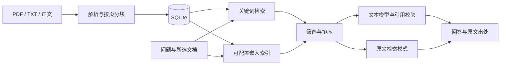

# 申报通 · RAG知识问答库

本地竞赛资料工作台。先导入真实文档，再围绕原文查找与回答问题，保留页码、段落及来源网址。

## 启动

需要 Node.js 20.19 或更高的兼容版本。首次安装：

```powershell
npm ci
npm run dev -- --webpack
```

访问 http://127.0.0.1:3000 。生产运行：

```powershell
npm run build
npm run start
```

两个启动命令都只监听本机。端口占用时可以使用 `npm run start -- --port 3001`。本版本为单人本地工作区，部署到公网前需要另外实现身份认证与访问控制。

## 已实现

- 导入含文字层PDF、TXT、Markdown，或直接粘贴正文；保存标题、年份、类型、赛事、阶段及来源网址。
- 按页与段落分块，最多10MB、50页、100万字符。扫描件、损坏文件、空正文会提示错误。
- 分块优先保留整行，通常不超过1100字符；带竖线、制表符或多空格分列的长表格行整体保留，超过4000字符会拒绝并提示拆分。无行边界的长正文按字符分块，不丢弃后半部分。
- SQLite持久化文档、片段、向量和最近30条问答显示。相同内容、来源与年度等元数据去重。
- 中文关键词检索；配置嵌入模型并建立索引后，进行关键词与余弦向量混合检索。不同模型的向量不会混用。
- 限定文档范围，展示带原文的引用卡片，打开整份提取正文并定位引用片段。这里的页码为PDF文件页序。
- 接入文本模型后，使用本次检索证据生成回答；回答需符合JSON格式并引用真实片段ID。调用或引用校验失败时返回原文检索结果。
- 删除资料时，同时删除其片段、向量和引用该资料的问答记录。重新索引失败保留已有索引和正文。



## 连接真实模型

```powershell
Copy-Item .env.example .env.local
```

在本机编辑 `.env.local`，填写实际服务商支持的配置：

```dotenv
AI_BASE_URL=服务商API基础地址，包含实际版本前缀
AI_API_KEY=文本服务密钥
AI_CHAT_MODEL=文本模型名
EMBEDDING_BASE_URL=嵌入API基础地址
EMBEDDING_API_KEY=嵌入服务密钥
AI_EMBEDDING_MODEL=嵌入模型名
RAG_DATA_DIR=./data
```

服务端分别向基础地址追加 `/chat/completions` 和 `/embeddings`，使用Bearer认证。嵌入地址与密钥留空时沿用文本服务配置。参数齐全仅代表“已配置”，实际请求才能验证连接。修改后重启服务，在“资料库”中建立向量索引；更换嵌入模型或服务地址后应重新索引。

密钥不会发送到浏览器，`.env.local` 已被Git忽略。没有模型配置时页面显示“原文检索模式”，只给出相关原文片段；不会伪装成已接入大模型。只配置文本模型时可在关键词检索基础上生成引用问答；只配置嵌入模型时可以混合检索并展示原文。

## 验证

```powershell
npm test
npm run typecheck
npm run build
# 先启动服务，再经真实上传接口验证你的两份附件：
npm run validate:data -- "竞赛目录PDF的完整路径" "学校管理办法PDF的完整路径"
```

默认验证服务为 `http://127.0.0.1:3000`，可设置 `VALIDATE_BASE_URL`。脚本保存真实资料，不录入示例规则；重复运行不会新增同一文档。详细结果在 `artifacts/data-validation.json`，可读记录在 `docs/RAG验证记录.md`。

测试中的合成比赛、模拟向量和本地HTTP服务仅存在于测试临时目录，不写入工作台知识库。它们验证索引、接口协议、范围与错误处理，不能替代真实服务商的模型质量验证。

## 数据保存与恢复

正文、元数据、向量和问答保存在 `data/knowledge.sqlite`。先停止服务，再备份整个 `data` 目录；恢复后启动即可。原始上传文件不另存副本，原文查看展示提取文字，请保留原始PDF附件。数据目录、构建结果和认证配置不提交Git。

主要接口：`GET /api/status`；`GET/POST /api/documents`；`GET/DELETE /api/documents/:id`；`POST /api/documents/:id/index`；`POST /api/questions`。导入使用multipart表单，问答使用 `{ "question": "问题", "documentIds": ["文档ID"] }`；范围留空表示全部文档。

## 当前验证边界

已导入用户提供的2024年竞赛目录和2023年学校管理办法，覆盖28页。目录中的全部84项保留为来源原文，计算机赛事的首期范围见现有《申报通-计算机相关竞赛首期清单.md》。尚未录入各赛事当前年度的报名通知、赛道细则或截止时间。

真实文本与嵌入API尚未配置，当前实际使用关键词原文检索。混合检索的分数权重与阈值是初始值，需要在接入实际嵌入模型后，用真实问题集校准。引用校验可以确保出处存在并属于本次检索范围，不能机械证明模型的每个结论都受到原文支持；接入模型后仍需做人工对照评测。

历史目录不自动等于学校当前认定的B类项目。没有公开来源网址的附件保留本地文档标题和页码，系统不生成虚构链接。OCR、联网采集、比赛推荐、资格核验与材料清单未包含在本次范围。
