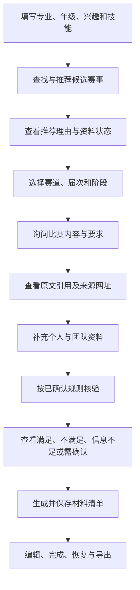
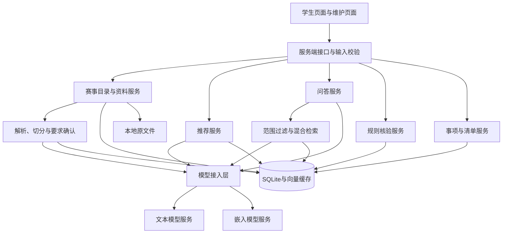
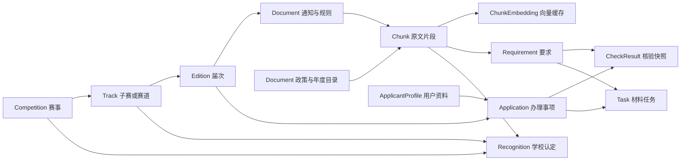
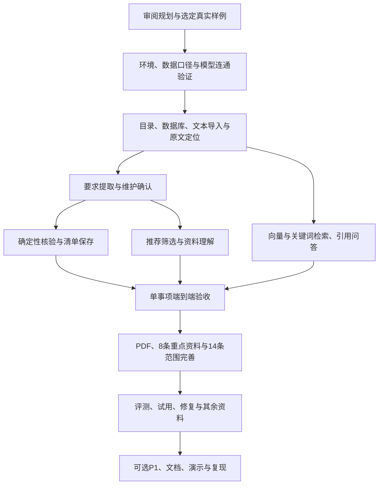

# 申报通项目开发流程框架

版本：V1.0规划稿。日期：2026年10月4日。

配套文件：《申报通-项目计划书.md》《申报通-计算机相关竞赛首期清单.md》。本文描述拟定流程、模块边界与验收顺序，不包含已经执行的工程搭建或测试结果。

## 1. 开发原则与成功路径

围绕一个真实赛事及具体赛道，先实现资料入库、来源定位、要求确认、推荐与问答、核验、清单保存，再扩展赛事数量。推荐入口优先服务学生发现比赛；维护入口保证数据和规则有依据。

推荐与核验分开：专业、兴趣与技能用于推荐；明确参赛限制由已确认规则计算。学校类别与年度、赛道及阶段关联，不能仅在赛事名称上放一个永久B类标签。

## 2. 用户操作流程



对于尚无当届资料的赛事，详情页仍可展示历史介绍和网址，但问答限定于已导入来源，报名状态显示“当届信息待补充”。

## 3. 总体架构

推荐技术选择：Next.js App Router、React、TypeScript；同一项目内使用服务端接口；SQLite保存数据；PDF.js作为PDF处理候选。具体版本在工程搭建阶段核验并锁定。



模型在推荐流程中用于理解需求和解释已计算结果；候选筛选和排序仍由推荐服务完成。数据库、原文件与API密钥仅由服务端访问，原文件通过受控的文件接口提供原文预览。

Next.js请求接口依据[官方Route Handlers文档](https://nextjs.org/docs/app/getting-started/route-handlers)设计。本地SQLite选择参考[官方适用场景说明](https://www.sqlite.org/whentouse.html)。PDF候选依据[PDF.js官方项目](https://mozilla.github.io/pdf.js/)，实际解析表现需用现有附件验证。

## 4. 模块边界

| 模块 | 职责 | 输入 | 输出 | 主要依赖 |
| --- | --- | --- | --- | --- |
| 目录服务 | 管理赛事、子赛、届次、别名与网址 | 维护者录入、目录资料 | 可筛选名录与详情 | 数据层 |
| 认定服务 | 保存学校年度类别及证据 | 政策、目录、维护确认 | 已确认或待核对的认定记录 | 原文片段、数据层 |
| 导入服务 | 校验文件、解析文字、保留定位 | 文本、TXT、文字PDF及元数据 | 文档、片段、处理状态 | PDF处理、文件存储 |
| 提取确认 | 提取草稿，维护者修订后发布 | 原文片段、事项范围 | 版本化要求及来源 | 文本模型、数据层 |
| 推荐服务 | 理解需求、筛选、标签排序和解释 | 用户资料、筛选条件 | 候选、理由、待补字段 | 目录、认定、规则、文本模型 |
| 检索服务 | 范围过滤，关键词与向量召回 | 事项范围、问题 | 原文片段及检索分数 | 向量缓存、嵌入模型 |
| 问答服务 | 基于检索上下文回答，校验引用 | 问题、片段、对话范围 | 结论、引用、待确认事项 | 检索、文本模型 |
| 核验服务 | 对已确认明确条件进行计算 | 用户资料、规则版本 | 逐项判定与原文依据 | 规则引擎、数据层 |
| 清单服务 | 从确认材料生成任务并合并保存 | 办理事项、材料与日期 | 可编辑任务、导出文本 | 数据层 |
| 质量记录 | 记录模式、错误、用量与评测 | 调用及人工评测结果 | 可核对的运行记录 | 模型接入、评测数据 |

推荐模块可以调用核验服务处理预筛选，核验服务不依赖AI生成的推荐文字。导出与已确认规则核验可在模型服务不可用时继续工作。

## 5. 数据关系与核心对象



图中的连线表示业务关联，不是完整数据库外键图。要求与认定可引用多个片段，需保留来源关联。

| 对象 | 主要字段与约束 |
| --- | --- |
| Competition | ID、原目录编号、名称、别名、内容标签、目录网址；首期14条父级赛事 |
| Track | 赛事ID、子赛或赛道名称、别名、方向；单赛道赛事也建立明确的默认记录 |
| Edition | 赛道ID、年份或届次标签、官方名称、资料覆盖状态；不同届次独立 |
| Recognition | 学校、赛事或赛道、适用年度、适用阶段、类别、确认状态、来源关联与确认时间 |
| Document | 类型、可选届次ID、阶段、标题、发布单位、发布时间、来源网址、版本、内容哈希、原文件路径与处理状态 |
| Chunk | 文档ID、原文、页码或段落、序号与内容哈希；引用ID稳定且可查 |
| ChunkEmbedding | 片段ID、服务与模型、维度、内容哈希、向量；不同模型缓存不混用 |
| Requirement | 届次、阶段、类型、适用目标、结构化值或条件、来源关联、确认状态与修订号 |
| ApplicantProfile | 学生类型、专业、年级、兴趣、技能、必要团队字段、资料修订号 |
| Application | 届次ID、目标阶段、资料ID、创建时间、状态及最近核验版本 |
| CheckResult | 办理事项、规则修订号、资料修订号、输入快照、逐项状态、解释与来源 |
| Task | 办理事项、来源要求ID、必交或可选、官方日期、自定日期、完成状态、自定标记、复核状态 |
| ExtractionRevision | 要求或提取批次、草稿、人工修改、操作者、修改时间；旧版本保留 |

认定来源可以是学校政策加年度目录，不能只保存其中一个链接。政策与目录的Document没有赛事届次也能入库。Requirement包含资格条件、材料、时间及其他要求，只有适用的资格条件进入对应核验。

截止时间保存原始文字、日期精度、时区及适用阶段。未写具体时刻的，不补23:59；仅日期已确定的，可在其后一个日历日显示“所列日期已过”，当日提示具体时刻未写明。

## 6. 四条核心处理流程

### 6.1 资料导入与规则发布

1. 维护者指定资料类型、赛事或政策范围、届次与阶段，输入来源信息。
2. 校验大小与类型。P0默认单文件不超过10MB、50页；这些是可配置项目限制。
3. 解析文字并显示预览；无文字PDF停在解析提示，不创建已完成索引状态。
4. 按标题与段落切分，保存原文及页码、段落。可从800—1200个汉字、相邻片段约100字重叠的配置开始验证，优先保持条件所在段落完整；最终参数由样例效果确定。
5. 文档和片段先落库，再生成向量及提取草稿。模型失败不删除已解析正文。
6. 提取项需携带真实片段ID；校验类型、日期精度和引用合法性。
7. 维护者修改、确认或标记待核实。确认项生成新的规则修订号并保留原草稿。
8. 发布后才能进入正式核验和任务生成。尚未确认的原文仍可被问答引用，但回答应注明该要求尚待确认。

重复导入以内容哈希和资料范围提示已存在；不只根据文件名去重。相同正文但不同来源记录保留各自来源关系，优先复用解析与向量结果。

### 6.2 推荐

1. 用户填写资料或用自然语言表达需求。
2. 模型提取候选字段，界面显示理解结果供修改；缺失项保留空值。
3. 按明确筛选条件过滤目录，学校已确认类别与待核对类别分开。
4. 已知、已确认的资格冲突归为条件不符；字段缺失或规则不完整的归为待确认。
5. 初始排序依次考虑兴趣标签命中数、技能标签命中数、专业内容标签命中数、资料完整度；相同结果按稳定ID排序。该顺序是P0可解释的设计选择，不是学习得到的效果。
6. 已知正在报名的状态可作为用户筛选条件；时间未知不自动排成正在报名，也不伪造“最近截止”。
7. 程序输出候选和结构化理由，模型仅转述这些理由。相关专业标签必须区分官方限制与维护者建议。

### 6.3 检索问答

1. 确定赛事、赛道、届次与阶段。问题涉及多个比赛时，先对候选分别检索再比较；名称不能唯一定位时要求用户选择。
2. 只在相应范围内检索通知和规则；问学校类别时额外检索对应认定来源。
3. 关键词与向量分别召回。初始候选各最多10条，用名次融合去重后取最多6条，不直接相加不同量纲的原始分数。数量是可调整配置。
4. 召回置信不足时不强行生成事实答案；阈值根据已标注样例校准，记录采用的模型和检索配置。
5. 生成结构化回答：结论、证据片段ID、待确认事项。原文中的指令作为资料内容，不作为系统指令执行。
6. 校验引用属于本次上下文，引用文字与原文相符；无效引用最多重新生成一次，仍失败则显示校验失败及可查看的原文。
7. 展示回答、原文入口及已保存的网址。出处网址由数据库提供，模型不得自由编造链接。
8. 保存可获得的耗时、用量、调用模式和检索范围，供评测追踪。

P0支持文字问答；复杂附件或链接未导入时明确提示来源尚未收录。对话历史不能让后续提问悄悄切换赛事或年份。

### 6.4 核验与清单

1. 读取当前事项、阶段与最新已确认规则，并记录修订号。
2. 按规则所需字段展示资料表；不要求与当前事项无关的信息。
3. 规则引擎只支持白名单条件：等于、不等于、集合包含或排除、数字比较、AND与OR组合。
4. 明确规则返回满足、不满足或信息不足；歧义、例外和未确认规则返回需人工确认。表达式作为数据解释，不执行脚本。
5. 参赛与资助按适用目标分别核验；用户未选择的资助目标不进入参赛资格汇总。
6. AND遇到确定假项可判假，OR遇到确定真项可判真；其余组合存在未知输入时保留未知。源规则复杂度超出白名单时交人工确认。
7. 总结显示已核对条件的结果及未确认项；存在待核对范围时不显示“全部资格已确认”。
8. 从当前已确认材料生成清单草稿，用户选择保存。依据“办理事项＋来源要求ID”合并任务，防止重复生成。
9. 保留自定准备日期、任务完成状态和自定任务；官方日期变更按P1复核流程处理。
10. 导出Markdown与CSV。CSV正确处理引号和换行，并避免用户文本在表格工具中被当作公式执行。

## 7. 版本与处理状态

文档状态与模型步骤分别记录：正文已解析、索引待生成或失败、提取待执行或失败、草稿待确认、规则已发布。界面展示实际完成的步骤，失败后只重试对应步骤。

缓存与快照约束：

- 向量键包含原文内容哈希、嵌入服务、模型与维度。
- 问答缓存若启用，必须包含赛事、赛道、届次、阶段、知识库修订号、问题及生成配置；实际检索范围变化就失效。
- 核验快照包含资料修订号与规则修订号；资料或规则修改后旧结果标记过期并重新计算。
- 新通知作为新版本保存；维护者明确指定替代关系，不自动以“时间更新”覆盖其他阶段通知。
- P0先保证结果与任务不会因失败丢失；P1再实现字段差异与任务影响提示。

## 8. 拟定工程目录

以下只是目录设计，当前尚未创建这些工程文件。

```text
申报通/
├─ src/
│  ├─ app/                 页面和服务端接口
│  ├─ components/          竞赛卡片、原文引用、资料表与任务组件
│  ├─ domain/              数据类型、规则表达式和状态定义
│  └─ server/
│     ├─ catalog/          赛事、届次、认定及来源
│     ├─ documents/        导入、切分、定位和要求确认
│     ├─ recommendation/   候选筛选与排序
│     ├─ retrieval/        关键词、向量检索与范围过滤
│     ├─ qa/               上下文、回答和引用校验
│     ├─ eligibility/      确定性规则计算
│     ├─ applications/     办理事项、任务与导出
│     ├─ ai/               模型接入和调用记录
│     └─ db/               SQLite访问与迁移
├─ data/                   本地数据库与原文件，不进入公开目录或Git
├─ fixtures/               可公开样例及来源说明
├─ tests/                  规则边界、引用范围和关键流程测试
├─ evaluation/             人工问题集、评分规则与真实结果
├─ docs/                   产品设计、技术说明和演示脚本
├─ .env.example            环境变量名称与说明，不含密钥
└─ README.md               安装、配置、启动和演示说明
```

服务端模块不得被浏览器组件导入；推荐界面不直接访问数据库或模型服务。具体文件拆分以第一阶段实现任务为准，不提前创建空模块。

## 9. 拟定接口契约

本表描述接口职责和输入输出，具体实现文件与请求模式在工程阶段落实。

| 拟定入口 | 关键输入 | 关键输出或约束 |
| --- | --- | --- |
| GET /api/competitions | 标签、年份、阶段、类别及状态过滤 | 名录、资料完整度与来源入口 |
| GET /api/competitions/:id | 赛事ID | 赛事、子赛、届次及认定记录 |
| POST /api/profiles | 用户主动填写的字段 | 保存后的资料ID和修订号 |
| POST /api/recommendations | 资料或自然语言需求、筛选条件 | 可修改的需求理解、候选和依据 |
| POST /api/documents | 文件或正文、来源、资料范围 | 文档ID、预览与处理状态 |
| POST /api/documents/:id/process | 指定索引或提取步骤 | 对应步骤结果，不覆盖确认规则 |
| POST /api/requirements/confirm | 草稿ID、修改、来源及当前修订号 | 新修订号；版本冲突返回明确提示 |
| GET /api/sources/:chunkId | 真实片段ID | 原文、页码或段落、文档元数据 |
| POST /api/questions | 事项范围、问题 | 结论、合法引用、待确认项与模式 |
| POST /api/applications | 届次、阶段与资料ID | 已保存办理事项 |
| POST /api/applications/:id/check | 资料修订号、核验目标 | 逐项结果与规则修订号 |
| POST /api/applications/:id/tasks | 清单草稿及来源 | 合并后的任务，不重复创建 |
| PATCH /api/tasks/:id | 完成状态、自定日期等可编辑字段 | 更新任务；官方来源字段另走维护修订 |
| GET /api/applications/:id/export | Markdown或CSV格式 | 可下载清单 |

服务端校验对象归属、范围与字段类型；P0本地单人模式不意味着接口可直接开放公网。处理错误统一携带错误代码、用户可理解说明及可否重试，不回传密钥或原始认证错误内容。

## 10. 开发依赖与执行顺序



图示表示模块依赖；第一轮开发按下表逐阶段验收，不同时展开所有分支。

| 阶段 | 主要任务 | 产物 | 可验证的完成标准 |
| --- | --- | --- | --- |
| D0 | 明确样例、模型服务、输入输出和范围 | 审阅后的规格、资料模板、连通结果 | 同一真实样例的年份、赛道、来源与人工答案明确 |
| D1 | 建立最小工程、存储和名录 | 可运行发现与详情页、14条基础记录 | 赛事及子赛关系可查；示例数据标记清楚 |
| D2 | 文本导入、切分、定位、重复导入处理 | 一个真实文档的持久化与引用入口 | 重启可恢复，片段原文准确，失败状态明确 |
| D3 | 提取草稿与确认、规则边界计算 | 来源完整的要求、核验与清单 | 缺字段、资助条件和阈值边界正确，任务可保存导出 |
| D4 | 真实向量检索、问答和引用校验 | 真实API问答 | 已知问题有依据，未知问题不补造，越范围引用被拒绝 |
| D5 | 需求理解、推荐与全流程连接 | 从找比赛到保存清单的完整案例 | 推荐理由可追溯，阶段不混用，模型失败仍保留数据 |
| D6 | PDF解析、8条重点资料及14条状态 | 初步完整P0 | 文字PDF定位可用，扫描件提示明确，缺资料如实显示 |
| D7 | 人工评测、学生试用、修复与余下资料 | 实测结果和修复记录 | 关键规则、未知问题、引用及清单验收通过 |
| D8 | 进度允许时P1；文档、演示、复现 | 交付包 | 按README复现，所有成果描述有实际证据 |

计划书M1对应D1—D2，M2对应D3—D5，M3对应D6，M4对应D7及可选P1，M5对应交付。模型连通在M0验证，避免到问答阶段才发现服务不可用。

## 11. 每次开发任务的工作方式

每轮只实现一个可验收模块或一段完整用户流程。任务描述包含目标、已有依赖、输入输出、允许改动范围、失败场景和验收方式。

执行顺序：读取当前实现→列出必要修改→实现最小可用结果→用真实样例和相关边界检查→修复失败→更新说明→记录真实Git提交。Git仓库在实际工程开始时建立，本次规划文档没有声称已提交。

首个工程任务建议限定为“14条赛事名录＋一份真实文本通知的保存与原文定位”。它完成后再接模型提取，避免只有页面和预置回答却无法落地资料。

## 12. 异常与恢复

| 场景 | 用户看到的状态 | 系统处理 |
| --- | --- | --- |
| PDF无文字 | 当前文件无法提取文字 | 保留导入失败说明，建议文字资料；不标记索引成功 |
| 文本模型不可用 | 本次生成失败，可重试 | 保存正文、已确认规则与任务；不保存失败输出为有效答案 |
| 嵌入服务不可用 | 向量索引未完成 | 保留正文，可使用明确标注的关键词模式，真实向量验收仍未通过 |
| 引用越范围或不存在 | 回答证据校验失败 | 有限重试后展示原文入口，不当作有效答案 |
| 新旧来源冲突 | 该要求需要确认 | 并列依据，维护者决定适用范围 |
| 当届通知缺失 | 当届信息待补充 | 展示明确年份的历史资料及来源 |
| 学校类别待核对 | 类别依据待核对 | 不进入已确认B类筛选 |
| 用户信息缺失 | 列出需要补充的字段 | 保留信息不足状态 |
| 规则或资料修订 | 原核验已过期 | 重新核验，P1进一步整理任务影响 |
| 重复保存清单 | 显示现有清单 | 合并来源任务，保留完成状态及自定任务 |

## 13. 质量验证框架

自动检查集中在重要业务逻辑：规则边界、赛事与届次过滤、引用合法性、重复任务合并、版本过期与导出内容。页面布局与低影响样式调整用人工检查，不写镜像实现的测试。

端到端验收用一个真实通知和两个不同资料案例，验证推荐状态、问答依据、补资料后的判断变化、保存恢复和导出。另覆盖扫描PDF、模型失败、未知时刻及冲突规则。

AI语义质量使用40道人工问题：30道开发集、10道保留集。记录标准答案及来源、检索片段、回答、引用支持、事实评分、模型与知识库版本、耗时及用量。推荐多解问题评价理由是否支持及是否漏掉明确候选。

问答基线采用同一生成模型比较无通知、全文上下文与检索上下文。明确规则案例全部与人工判定一致；指定无依据与越范围案例全部通过。事实与引用指标报告实测比例及样本数量，不承诺未经测量的数值。

## 14. 交付与审阅边界

本文给出产品开发流程和模块框架，具体文件级实施任务、依赖锁定与模型配置在规划审阅后落实。本次没有创建应用代码、安装产品依赖、运行产品测试或发布网站。

交付时提供源代码、初始化资料、配置示例、启动说明、数据来源、评测集及结果、演示脚本和备份方法。公开样例只使用可分享通知及虚构用户资料；真实资料和密钥不进入代码仓库。
